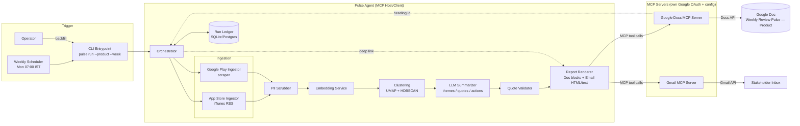
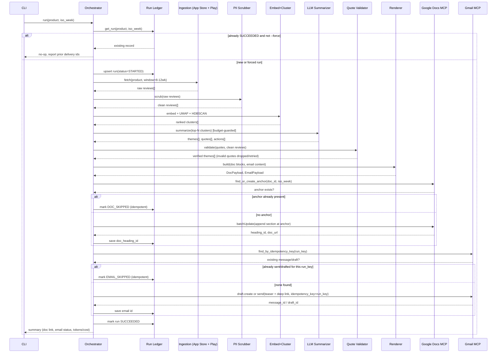
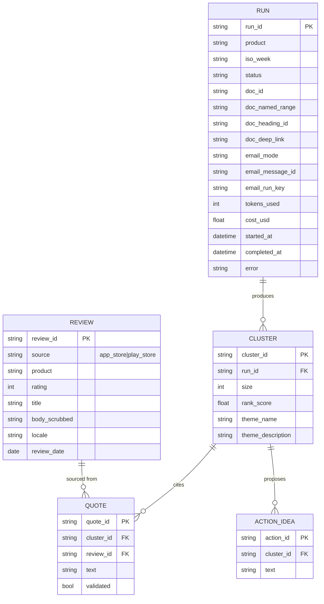

# Weekly Product Review Pulse — Architecture

Status: Implemented — all 6 phases built and passing (275 tests, `python Phase6-Orchestration-Hardening/scripts/run_full_regression.py`); live-verified end-to-end against real Docs/Drive/Gmail MCP servers, 6 configured products, 3x/week scheduling active
Companion to: [ProblemStatement.md](./ProblemStatement.md) · See also: implementationPlan.md (phased delivery, exit criteria)

> **Resolved — MCP host**: the project does **not** build its own MCP host/client from scratch; it uses the **official MCP Python SDK** (`pip install mcp`) directly inside its own synchronous orchestrator (`orchestrator/run.py`). The Claude Agent SDK was considered and rejected: its tool-use mechanism requires Claude (the model) to decide when to invoke a tool during a conversation, with no way for application code to call a specific tool with specific arguments deterministically — a mismatch for idempotency-critical delivery, where the orchestrator itself must decide exactly when to call each tool, never an LLM's judgment call. The plain MCP client SDK is the protocol's own standard library — satisfying "run on an existing one" — and lets the orchestrator call tools with zero LLM involvement in that decision. See Phase5-MCP-Delivery/README.md for the full reasoning and Phase5-MCP-Delivery/pulse/mcp/host_adapter.py for the implementation.
>
> **Resolved — MCP servers**: [`taylorwilsdon/google_workspace_mcp`](https://github.com/taylorwilsdon/google_workspace_mcp) (community, actively maintained), self-hosted, covering Docs, Drive, and Gmail in one server/one OAuth setup (Drive added 2026-08-31, for chart-image delivery — §4a; confirmed live it needed no new OAuth consent). §7 below reflects this server's actual tool set, which required two changes from the original sketch: no named-range read tool (Docs idempotency now checks document content for the heading text, not a named-range lookup) and no draft-creation tool or custom email headers (Gmail idempotency now uses a body-text marker instead of a header, and "draft mode" never calls the server at all rather than creating a real draft).

---

## 1. Architectural goals & constraints

These follow directly from the problem statement and drive every design decision below:

| Constraint | Source requirement | Design consequence |
|---|---|---|
| No direct Docs/Gmail API calls from the agent | "MCP-based delivery" | Agent is an **MCP host/client only**; all writes go through tool calls on two MCP servers |
| No Google credentials in agent codebase | Non-goal: "Storing Google OAuth secrets in the agent" | OAuth lives entirely inside the MCP servers' own config/secret store |
| Re-running (product, ISO week) must not duplicate | "Idempotent runs" | Stable **section anchor** in the Doc + a **run ledger** gating Gmail sends |
| Quotes must be real | "validation so quotes must appear in real review text" | A verification step that substring/fuzzy-matches every quote against scrubbed source text before it can reach a report |
| Reviews are data, not instructions | "Safety and quality" | Review text is never concatenated into a system/instruction prompt; it's always delimited, quoted, untrusted user content |
| Auditable | "record delivery identifiers... what was sent when" | A persistent run ledger keyed by (product, iso_week) storing doc/email identifiers |
| Weekly cadence + backfill | "scheduled job... CLI for backfill of any ISO week" | Scheduler triggers the same CLI entrypoint the operator uses manually |
| Cost bounded | "cost/token limits per run" | A budget guard wrapping every LLM call, enforced per run |
| English-only analysis | Added requirement: only analyze reviews written in English; exclude Hinglish (Hindi written in Latin/English script); emoji characters are not review content | A language filter (`safety/language_filter.py`) drops non-English and Hinglish reviews before scrubbing/persistence; emoji characters are stripped from the English text that is kept |

---

## 2. High-level component view

Key point: the **only** edges that touch Google are `DOCSMCP → GDOC` and `GMAILMCP → GMAIL`. The agent process never holds a Google credential and never calls `docs.googleapis.com` / `gmail.googleapis.com` itself.

---

## 3. Module map (concern → module)

| Concern | Module | Responsibility |
|---|---|---|
| Data retrieval | `ingestion/app_store.py` | Pull iTunes customer-reviews RSS for a product's App Store id, page through until window boundary, normalize to `Review` |
| Data retrieval | `ingestion/play_store.py` | Scrape Google Play reviews for a product's package name, normalize to `Review` |
| Safety | `safety/pii_scrubber.py` | Regex + NER pass removing emails, phones, account/card-like numbers; runs pre-embedding and pre-publish |
| Safety | `safety/prompt_guard.py` | Wraps review text in inert delimiters; strips/flags text that resembles instruction injection before it reaches the LLM context |
| Safety | `safety/language_filter.py` | Drops non-English and Hinglish (Hindi written in Latin script) reviews before scrubbing; strips emoji characters from the text that is kept |
| Reasoning | `analysis/embeddings.py` | Batches scrubbed review text through an embedding model |
| Reasoning | `analysis/clustering.py` | UMAP reduction + HDBSCAN clustering, cluster scoring/ranking (size × recency) |
| Reasoning | `analysis/summarize.py` | Per-cluster LLM calls → theme name, description, candidate quotes, action ideas |
| Reasoning | `analysis/quote_validator.py` | Confirms every candidate quote is a real substring (normalized) of a source review; drops/repairs failures |
| Output generation | `render/doc_blocks.py` | Builds Google Docs `batchUpdate` request bodies for the heading + named range (§5.1) |
| Output generation | `render/email.py` | Builds Gmail HTML + plain-text teaser referencing the Doc deep link |
| Output generation | `quant_analysis.py` | Pure computation (no I/O) of a `QuantSnapshot` from reviews + clustering + summarize output: sentiment split (from star rating), star distribution, per-theme volume/sentiment, priority quadrant, and (given a prior week's snapshot) a `WowComparison` — see §4a |
| Output generation | `quant_store.py` | SQLite-backed persistence of each run's `QuantSnapshot`, keyed `(product, iso_week)`, so the next week's run can compute a real week-over-week delta instead of an estimate — separate from the `RUN` ledger (§6), a different concern (analytical history vs. delivery audit trail) |
| Output generation | `charts.py` | Renders the report's charts (sentiment, star distribution, theme ranking, priority matrix, week-over-week trend) as PNG bytes via matplotlib (`Agg` backend, headless) — Google Docs has no native chart object, so every chart is an image |
| Output generation | `cxo_report.py` | Assembles the CXO Customer Voice report from a `QuantSnapshot` (+ optional `WowComparison`) and the LLM's qualitative theme output into an ordered list of text/chart/table blocks, and delivers each block to the Doc via `delivery/docs_client.py` — see §4a |
| Human-visible delivery | `delivery/docs_client.py` | Thin wrapper calling **Docs MCP** and **Drive MCP** tools only (no Google SDK) — text, tables, and images |
| Human-visible delivery | `delivery/gmail_client.py` | Thin wrapper calling **Gmail MCP** tools only (no Google SDK) |
| Orchestration | `orchestrator/run.py` | Sequences the pipeline, owns the run ledger, enforces idempotency and budget limits |
| Entry points | `cli.py` | `pulse run`, `pulse backfill`, `pulse status` |
| Config | `config/products.yaml` | Per-product: App Store id, Play Store package, target Doc id/title, stakeholder distribution list |

This mirrors the concern table in the problem statement 1:1, with "Human-visible delivery" isolated to two thin client modules that speak MCP only.

---

## 4. Data flow & pipeline stages

Stages, in order:

1. **Ingest** — App Store RSS (paged) and Google Play (scraper) for the configured window (default 8–12 weeks, configurable), normalized into a common `Review` shape.
2. **Scrub** — Non-English and Hinglish (Hindi written in Latin script) reviews are dropped; emoji characters are stripped from the remaining English text; PII is then removed before any text leaves the ingestion boundary; this is also where reviews are marked as untrusted/data-only for downstream prompting.
3. **Embed + Cluster** — sentence embeddings → UMAP dimensionality reduction → HDBSCAN density clustering; clusters ranked by a size/recency-weighted score; noise points bucketed separately.
4. **Summarize** — one LLM call per top-ranked cluster (bounded N, e.g. top 5–8) producing theme name, one-line description, 1–3 candidate verbatim quotes, and action ideas.
5. **Validate** — every candidate quote must normalized-substring-match a real review in the clean set; failures are dropped and, budget permitting, the cluster is re-summarized once before falling back to omitting quotes for that theme.
6. **Render** — a single canonical `ReportPulse` object is projected into (a) Google Docs `batchUpdate` requests and (b) an HTML/plain-text email teaser — one source of truth, two renderers.
7. **Deliver** — Docs MCP append (idempotent via anchor), then Gmail MCP draft/send (idempotent via run key), in that order, since the email needs the Doc's real heading link.
8. **Record** — the run ledger is updated at each delivery sub-step, not just at the end, so a crash mid-run leaves an accurate partial record rather than silence.

---

## 4a. The CXO Customer Voice report (rendering + delivery detail)

Revised 2026-08-31: the original one-page text narrative (§4 stage 6 as first designed) was replaced with a CXO-level, visually structured report, at the operator's explicit request, so a Senior PM/leadership reader can scan the Doc in under a minute and see comparable, quantified signal rather than prose alone. The pipeline change is additive to §4, not a fork of it — steps 1–5 (ingest → validate) are unchanged; only stage 6 ("Render") and the delivery leg of stage 7 got materially richer.

**What gets computed (`quant_analysis.py`, pure functions, no I/O)**
- `QuantSnapshot`: total reviews, average rating, sentiment split (1–2★ = negative, 3★ = neutral, 4–5★ = positive — an explicit, documented heuristic, not invented data), star-rating distribution, per-theme `ThemeMetrics` (review count, % of total, sentiment split), and an "issue" count aliased to the negative-sentiment count.
- Priority quadrant per theme: `high_volume = pct_of_total >= average_theme_volume_pct` crossed with `high_negative = negative_pct >= 50%`, producing Critical / Monitor / Emerging-risk / Low-priority.
- `WowComparison`: only computed when a prior ISO week's `QuantSnapshot` is found in `quant_store.py`'s SQLite table (keyed `(product, iso_week)`, separate from the `RUN` ledger in §6). Theme-to-theme matching across weeks is best-effort fuzzy name matching (clustering isn't deterministic across independent weekly runs), not a guaranteed identity — theme deltas are labeled `new`/`increasing`/`decreasing`/`stable` accordingly, and top-line metrics (total reviews, % positive/negative) always compare exactly since they don't depend on theme matching.

**What gets rendered (`charts.py`, `cxo_report.py`)**
- Charts (`charts.py`) are matplotlib PNGs — a modern, restrained SaaS-dashboard palette (dark charcoal text, green/red/amber for positive/negative/watch signal, one blue accent), never 3D, minimal gridlines: a 100%-stacked sentiment bar, a star-rating bar, a theme-volume ranking bar, a priority-matrix scatter (with quadrant background tints), and — when a `WowComparison` exists — a week-over-week trend line chart.
- `cxo_report.py` assembles the report as an ordered list of typed blocks (text, chart image, table) covering: an executive KPI snapshot, strengths-vs-pain-points cards, a theme×sentiment table (heatmap-shaded by % negative), the priority-matrix chart, week-over-week trend + a recurring/new-issue breakdown (when available), the full per-theme qualitative analysis (description + real quotes + actions, unchanged from the original LLM/validator output — this report layer never re-analyzes or invents content, only computes and displays), CXO takeaway statements (template-generated from the real numbers, not LLM-authored), and a leadership priority (P0/P1/P2) table.
- Every number in the report traces back to `QuantSnapshot`/`WowComparison`; anything not calculable from real data is rendered as "Not available from source data" rather than estimated.

**How it reaches the Doc (Docs + Drive MCP)**
- Charts have no native Docs API object — each PNG is uploaded to Drive (`create_drive_file`), made reader-shareable (`set_drive_file_permissions` — the real `insertInlineImage` request needs a publicly-fetchable image even for a file the same account owns), then inserted by Drive file id (`insert_doc_image`). This is why the Docs MCP server connection now also loads Drive tools (§7) — confirmed live that this didn't require new OAuth consent, only widened the tool surface, since the token already carried Drive scope.
- Tables (Theme×Sentiment, Leadership Focus) are built manually: `insert_table`, then `debug_table_structure` to get each cell's real insertion index, then cells are filled in descending-index order in one batch (inserting into an earlier cell first would shift every later cell's index). The server's own `create_table_with_data` convenience tool was tried and found unreliable (creates the right-shaped table but silently leaves every cell empty) — not used.
- Cell shading/backgrounds/padding use `update_table_cell_style`; card-style callout boxes (KPI cards, takeaway callouts, per-theme detail cards) use `update_paragraph_style`'s `shading_color`/`border_edges` directly on body paragraphs — no table needed for a single-column box, only for genuinely side-by-side layout (KPI row, two-column strengths/pain-points, any data table).
- **Known server quirk, workaround in place**: styling many table cells' text from *within the same long-lived MCP session* that built the rest of the document (dozens of prior calls already made) intermittently corrupts the result — colors/sizes bleed across cells that should be independently styled. The confirmed, reliable workaround is a short, separate, freshly-connected session that re-applies table-cell text styling after the main build completes; root cause not fully understood (suspected `google_workspace_mcp` state/consistency issue under a long rapid-fire call sequence, not a Docs API limitation per se — the same operations succeed immediately in a fresh session against the same document). This is currently a manual/scripted step, not yet folded into `cxo_report.py`'s normal automated delivery path.

---

## 5. Idempotency design (the two mechanisms named in the problem statement)

### 5.1 Google Doc — stable section anchor

- Each product has exactly one running Doc (e.g. "Weekly Review Pulse — Groww"), identified by a `doc_id` in `config/products.yaml`.
- Every section written by the pipeline is prefixed with a **machine-readable heading** embedded as the section's first line, e.g.:
  `Groww — Week of 2026-08-24 – 2026-08-30 (ISO 2026-W35)`
  and a bookmark/named range `pulse-section-groww-2026-W35` is created alongside it (`create_named_range`, a `batch_update_doc` operation on the chosen Docs MCP server) for future addressability.
- Before appending, the orchestrator asks the Docs MCP server for the document's current content and checks whether this week's heading text is **already present**. If it is, the run is treated as already delivered to the Doc (`DOC_SKIPPED`) — no new content is inserted, even under `--force`. *(Revised from an earlier design that looked up the named range directly: the chosen server, `google_workspace_mcp`, has no dedicated named-range read tool, so content-text search is the actual mechanism — see Phase5-MCP-Delivery/README.md.)*
- `--replace-doc-section` (force-replace) is not implemented yet — it would require deleting a precise text range, which needs index information this server doesn't confirm it can provide. It fails loudly (`NotImplementedError`) rather than risk corrupting the Doc.
- The Doc's URL (not a precise in-page heading anchor — resolving that depends on capabilities not yet confirmed available) is what the deep link and the ledger record use.

### 5.2 Gmail — run-scoped idempotency key

- Each run computes a deterministic `run_key = hash(product, iso_week, report_content_hash)`.
- Before sending, the orchestrator checks the **run ledger** first (cheap, local) for an existing `email_status` for `(product, iso_week)`. This is the primary guard and is sufficient for the normal case (single agent instance, durable ledger).
- As defense-in-depth against a ledger loss or concurrent run, the `run_key` is embedded as a plain-text marker (`[[pulse-run-key:<run_key>]]`) in the email body, and the Gmail MCP client searches for that marker via normal Gmail text search before sending, so duplicate detection doesn't rely solely on the ledger. *(Revised from an earlier design that used a custom `X-Pulse-Run-Key` header: the chosen server's send tool doesn't support custom headers, so a body-text marker is the actual mechanism — works with any Gmail MCP server that can search message content, not just this one.)*
- Draft vs. send is an environment setting (`config/environments.yaml: email_mode: draft|send`), defaulting to `draft` in dev/staging. In `draft` mode, the Gmail MCP server is **never called at all** — the chosen server has no draft-creation tool, so draft mode only reports what would have been sent, preserving "nothing is ever actually delivered" without a real draft object existing anywhere. `send` mode is promoted to only for the confirmed production schedule.

---

## 6. Data model

The `RUN` table **is** the audit log required by the problem statement ("record delivery identifiers... what was sent when, for which week"). `REVIEW` text is stored only in scrubbed form; raw text is held in memory for the duration of a run and not persisted, minimizing PII exposure surface.

---

## 7. MCP integration details

The agent talks to **one unified MCP server**, [`taylorwilsdon/google_workspace_mcp`](https://github.com/taylorwilsdon/google_workspace_mcp) (community, self-hosted), which covers both Docs and Gmail and holds the Google OAuth. The agent connects to it using the **official MCP Python SDK** (`mcp` package) over stdio — see Phase5-MCP-Delivery/pulse/mcp/host_adapter.py. The agent's config references the server's launch command and endpoint, never credentials.

**Google Docs tools used** (real tool names, verified live against `google_workspace_mcp`)
| Tool | Purpose |
|---|---|
| `get_doc_content` | Idempotency check: does this week's heading text already appear in the document? Also used to read back delivered content for verification. |
| `inspect_doc_structure` | Real paragraph/table start/end indices — used to locate just-inserted content before styling it (no index math done blind) |
| `batch_update_doc` | Executes the raw Docs API request objects atomically: `insert_text`, `insert_table`, `insert_page_break`, `update_paragraph_style` (incl. `shading_color`/`border_edges` for card/callout boxes), `format_text`, `update_table_cell_style`, `create_named_range` |
| `debug_table_structure` | Real per-cell insertion index after `insert_table` — required because `create_table_with_data` (the convenience tool) was found unreliable (§4a) |
| `insert_doc_image` | Inserts an already-uploaded, shared Drive image (a chart PNG) into the Doc by file id |
| `update_doc_headers_footers` | Sets the report's footer branding text |
| `export_doc_to_pdf` | Used for visual QA of the rendered report during development, not part of the delivery path |

**Google Drive tools used** (added 2026-08-31 for chart delivery — §4a; confirmed live that this widened the tool surface without requiring new OAuth consent, since the existing token already carried Drive scope)
| Tool | Purpose |
|---|---|
| `create_drive_file` | Uploads a chart PNG (base64) so it can be referenced by Drive file id |
| `set_drive_file_permissions` | Makes the uploaded chart reader-shareable — the real Docs `insertInlineImage` request needs a publicly-fetchable image even for a file the same account already owns |

**Gmail tools used**
| Tool | Purpose |
|---|---|
| `search_gmail_messages` | Idempotency defense-in-depth: search message content for the `[[pulse-run-key:...]]` marker |
| `send_gmail_message` | Production path, `email_mode: send` only — never called at all in `draft` mode |

All tool names/argument shapes above are verified against a live `google_workspace_mcp` instance (real OAuth, real Docs/Drive/Gmail), not just the server's published source.

The agent never falls back to direct REST calls if the MCP server is unavailable — a failed MCP call is a failed run, retried with backoff, then surfaced as an error in the ledger (`status=FAILED`, `error=<mcp error>`), not silently bypassed.

---

## 8. Safety & prompt-injection posture

- Review text is always passed to the LLM inside an explicit, clearly delimited **data block** (e.g. fenced with a random-per-run boundary token), with a system instruction that the content between the boundaries is untrusted user data to analyze, never instructions to follow.
- The prompt guard (`safety/prompt_guard.py`) heuristically flags reviews containing imperative/instruction-like patterns (e.g. "ignore previous instructions", markdown/code fences attempting to break out) — flagged reviews are still analyzed for sentiment/theme but excluded from being selected as verbatim quotes.
- PII scrubbing runs twice: once before embedding/LLM exposure, and once more as a final gate immediately before content is sent to the Docs/Gmail MCP calls, so a scrubber miss upstream doesn't compound in a bug elsewhere in rendering.
- Quote validation (§4 step 5) is itself a safety control, not just a quality one — it prevents the LLM from fabricating a quote that could misrepresent a real user.
- Language filtering (`safety/language_filter.py`) runs before PII scrubbing: a script-ratio heuristic drops reviews written in a non-Latin script (Hindi in Devanagari, etc.), and a curated Hindi/Hinglish wordlist heuristic drops Hindi-sounding reviews written in Latin script. Both are heuristics, not a trained language-detection model, and are tuned toward precision (avoid wrongly dropping real English feedback) over recall (catching every non-English review) — see Doc/Evaluation/Phase2-Ingestion-Safety.md for targets and known gaps. Emoji characters are stripped before language classification and before any text is treated as review content, so emoji never influence the language decision or appear in a quote.

---

## 9. Cost & reliability controls

- **Budget guard**: each run is allotted a token/cost ceiling (`config/environments.yaml: max_tokens_per_run`, `max_cost_usd_per_run`). The summarizer stops issuing new cluster-summary calls once the ceiling is approached, prioritizing highest-ranked clusters first so the top themes are always covered even if the run is truncated.
- **Retries**: ingestion and MCP calls use bounded exponential backoff (e.g. 3 attempts) for transient failures; LLM calls retry once on malformed/unparseable output before falling back to a template-only cluster entry (theme name from cluster keywords, no quotes).
- **Partial-failure semantics**: Doc delivery and Gmail delivery are independent ledger fields — a Gmail MCP outage after a successful Doc append is recorded as `doc: SUCCEEDED, email: FAILED`, and a retry only re-attempts the email leg (Doc anchor check makes the Doc leg naturally skip).

---

## 10. Scheduling & operation

- **Cadence**: one report per product per ISO week — but each product's trigger is registered **three times a week** (Monday 08:15, Wednesday 08:15, Saturday 09:00 IST; see Phase6-Orchestration-Hardening/scheduling/register_weekly_task.ps1), all invoking the same `pulse run --product <name>`. This is a resilience mechanism, not three separate reports: idempotency stays keyed on `(product, iso_week)` (§5), so whichever of the three triggers fires first and succeeds each week produces that week's report, and the other two find the week already `SUCCEEDED` and no-op (a cheap ledger lookup — no ingestion/LLM/delivery work runs again). The point is surviving the host machine being off, asleep, or unplugged on any one of the three days, not more frequent reporting. Revised 2026-08-31 from the original single-Monday-trigger design at the operator's explicit request, after confirming this doesn't mean three reports.
- **Backfill**: `pulse backfill --product <name> --week 2026-W30` runs the identical pipeline for a historical ISO week (window is still computed relative to that week's Friday/Sunday boundary, not "today").
- **Status/audit**: `pulse status --product <name> --week <iso_week>` reads the run ledger and prints doc link + email status without re-running anything.
- Products are configured, not hardcoded — Porter was added as the 6th product this way (a `products.yaml` entry with its App Store id, Play Store package, and target Doc id, no code change).

---

## 11. Non-goals reflected in the architecture

Per the problem statement, the architecture deliberately does **not** include: a general-purpose Workspace API layer (only the narrow Docs/Drive/Gmail MCP tool surfaces above — Drive is scoped to chart-image upload/sharing only, nothing else), a streaming/BI pipeline (the Doc is the durable artifact; the ledger is operational metadata, and `quant_store.py`'s snapshot history exists only to compute real week-over-week deltas, not as a general analytics store), social-media ingestors, or any credential storage for Google OAuth inside the agent (that lives entirely in the MCP servers' own deployment config, outside this repo's scope).

---

## 12. Requirement → architecture traceability

| Problem statement requirement | Satisfied by |
|---|---|
| Ingest App Store + Play Store, 8–12wk window | §3 `ingestion/*`, §4 stage 1 |
| Clustering via UMAP + HDBSCAN, LLM theming | §3 `analysis/*`, §4 stages 3–4 |
| Quotes validated against real text | §3 `quote_validator.py`, §4 stage 5, §8 |
| CXO Customer Voice report, Docs = system of record | §4 stage 6, §4a, §6 `RUN` model |
| Real quantitative metrics, week-over-week trend, no invented numbers | §4a `quant_analysis.py`, `quant_store.py` |
| Delivery only via Docs MCP + Drive MCP (scoped) + Gmail MCP | §2, §7 |
| No direct Docs/Gmail REST calls, no stored OAuth | §2, §7, §11 |
| Idempotent Doc section | §5.1 |
| Idempotent email send | §5.2 |
| Auditable delivery identifiers | §6 `RUN` table |
| PII scrubbing, reviews as data | §8 |
| Cost/token limits per run | §9 |
| Weekly cadence + CLI backfill | §10 |
| Draft-only default in dev/staging | §5.2, §10 |
| English-only analysis; Hinglish and emoji content excluded | §3 `safety/language_filter.py`, §4 stage 2, §8 |
