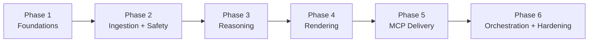

# Weekly Product Review Pulse — Implementation Plan

Status: Draft v1
Companion to: [ProblemStatement.md](./ProblemStatement.md) · [Architecture.md](./Architecture.md)

This plan breaks the architecture into 6 phases. Each phase has its own **evaluation file** (how we know it's correct/good) and **edge-case file** (what tricky inputs/failures it must survive):

| Phase | Evaluation | Edge cases |
|---|---|---|
| 1 — Foundations | [Evaluation/Phase1-Foundations.md](./Evaluation/Phase1-Foundations.md) | [EdgeCases/Phase1-Foundations.md](./EdgeCases/Phase1-Foundations.md) |
| 2 — Ingestion & Safety | [Evaluation/Phase2-Ingestion-Safety.md](./Evaluation/Phase2-Ingestion-Safety.md) | [EdgeCases/Phase2-Ingestion-Safety.md](./EdgeCases/Phase2-Ingestion-Safety.md) |
| 3 — Reasoning | [Evaluation/Phase3-Reasoning.md](./Evaluation/Phase3-Reasoning.md) | [EdgeCases/Phase3-Reasoning.md](./EdgeCases/Phase3-Reasoning.md) |
| 4 — Report Rendering | [Evaluation/Phase4-Rendering.md](./Evaluation/Phase4-Rendering.md) | [EdgeCases/Phase4-Rendering.md](./EdgeCases/Phase4-Rendering.md) |
| 5 — MCP Delivery & Idempotency | [Evaluation/Phase5-MCP-Delivery.md](./Evaluation/Phase5-MCP-Delivery.md) | [EdgeCases/Phase5-MCP-Delivery.md](./EdgeCases/Phase5-MCP-Delivery.md) |
| 6 — Orchestration, Scheduling & Hardening | [Evaluation/Phase6-Orchestration-Hardening.md](./Evaluation/Phase6-Orchestration-Hardening.md) | [EdgeCases/Phase6-Orchestration-Hardening.md](./EdgeCases/Phase6-Orchestration-Hardening.md) |

---

## How to read this plan

Phases 1–4 are **host-agnostic**: they're pure ingestion/analysis/rendering logic with no MCP calls, so they were built and fully tested before the MCP host decision was made. That decision is now resolved (official MCP Python SDK + `google_workspace_mcp`, see Architecture.md's "Resolved — MCP host" note and Phase5-MCP-Delivery/README.md), and Phase 5 is implemented against it. Phase 6 wires everything into the scheduled, production-shaped system.

Phase 4 can start from a hand-authored fixture `ReportPulse` in parallel with the back half of Phase 3, if desired — it doesn't strictly need real clustering output to build the renderer.

---

## Phase 1 — Foundations

**Goal**: stand up the skeleton everything else builds on — config, data model, ledger, CLI shell — with zero external dependencies.

**Architecture sections covered**: §3 (`config/*`, `cli.py`), §6 (`RUN` table)

**Tasks**
- Repo/package structure matching the module map (§3)
- `config/products.yaml` schema + loader/validator, pre-populated with the 5 initial products (INDMoney, Groww, PowerUp Money, Wealth Monitor, Kuvera)
- `config/environments.yaml` schema (`email_mode`, `max_tokens_per_run`, `max_cost_usd_per_run`, ingestion window weeks)
- Run ledger schema (§6 `RUN` table) + SQLite init/migration
- `cli.py` skeleton: `pulse run`, `pulse backfill`, `pulse status` — argument parsing wired to a no-op orchestrator stub
- Structured logging scaffolding

**Exit criteria**
- [ ] `pulse status --product groww --week 2026-W30` runs against an empty ledger and reports "no run found"
- [ ] Config loader rejects a malformed/unknown product with a clear error, accepts all 5 real products
- [ ] Ledger round-trip test: insert a `RUN` row, read it back with all fields intact

**Out of scope**: any real ingestion, clustering, LLM, or MCP call.

**Requirement traceability**: auditable runs (ledger exists), weekly cadence + CLI backfill (CLI shell), config-driven products (§10).

---

## Phase 2 — Ingestion & Safety

**Goal**: real reviews in, PII and prompt-injection risk out — independently testable without touching clustering or LLMs.

**Architecture sections covered**: §3 (`ingestion/*`, `safety/*`), §4 stages 1–2, §6 (`REVIEW` table)

**Tasks**
- `ingestion/app_store.py` — iTunes customer-reviews RSS, paged, window-filtered, normalized to `Review`
- `ingestion/play_store.py` — Google Play scraper, normalized to `Review`
- Shared `Review` model used by both connectors
- `safety/pii_scrubber.py` — regex + NER pass (emails, phones, account/card-like numbers)
- `safety/prompt_guard.py` — flags instruction-injection-shaped text, excludes it from quote eligibility
- `safety/language_filter.py` — drops non-English and Hinglish (Hindi written in Latin script) reviews before scrubbing; strips emoji characters from the English text that is kept
- Persist scrubbed reviews to the `REVIEW` table for the run

**Exit criteria**
- [ ] For a configured product, ingestion returns reviews within the configured window, deduplicated by `(source, review_id)`
- [ ] 100% of a labeled PII fixture set has emails/phones/card-like numbers removed before leaving the scrubber
- [ ] Labeled injection-attempt fixtures are flagged and excluded from quote-eligibility (verified by test), while still contributing to theme signal
- [ ] Labeled non-English and Hinglish fixtures are dropped before persistence; emoji characters are stripped from kept English review text without altering the surrounding words

**Out of scope**: embeddings, clustering, LLM calls, rendering, delivery.

**Requirement traceability**: ingest App Store + Play Store 8–12wk window; PII scrubbing; reviews-as-data (§8); English-only analysis, Hinglish and emoji exclusion.

---

## Phase 3 — Reasoning (Embeddings, Clustering, Summarization, Quote Validation)

**Goal**: turn scrubbed reviews into ranked, named themes with validated quotes and action ideas — testable offline against fixture corpora, with LLM calls mockable/recordable.

**Architecture sections covered**: §3 (`analysis/*`), §4 stages 3–5, §8, §9 (budget guard)

**Tasks**
- `analysis/embeddings.py`
- `analysis/clustering.py` — UMAP + HDBSCAN, size × recency ranking score
- `analysis/summarize.py` — per-cluster LLM calls with delimited untrusted-data blocks (§8), budget-guarded
- `analysis/quote_validator.py` — normalized substring match; retry-once-then-omit on failure
- Budget guard (`max_tokens_per_run`, `max_cost_usd_per_run`) enforced across summarization calls
- Golden-set evaluation harness (see [Evaluation/Phase3-Reasoning.md](./Evaluation/Phase3-Reasoning.md))

**Exit criteria**
- [ ] On a fixed, seeded fixture corpus, clustering produces stable cluster counts across repeated runs
- [ ] 100% of quotes appearing in the final theme list pass validation against source review text
- [ ] With a deliberately low budget ceiling, summarization truncates gracefully (highest-ranked clusters first) without crashing, and logs accurate token/cost usage

**Out of scope**: Doc/email rendering, MCP delivery.

**Requirement traceability**: clustering + LLM theming; quote validation; cost/token limits per run.

---

## Phase 4 — Report Rendering

**Goal**: project a canonical `ReportPulse` into Google Docs `batchUpdate` blocks and a Gmail HTML/text teaser — no live MCP calls, output inspectable as local files.

**Architecture sections covered**: §3 (`render/*`), §4 stage 6

**Tasks**
- `ReportPulse` canonical schema (themes, quotes, actions, period, "who this helps")
- `render/doc_blocks.py` — `batchUpdate` request JSON (heading + content) plus named-range creation request (§5.1)
- `render/email.py` — HTML + plain-text teaser with a deep-link placeholder
- Golden-file tests: fixed `ReportPulse` in → approved rendered fixture out

**Exit criteria**
- [ ] Rendered Doc block JSON is structurally valid against the Docs API `batchUpdate` request shape (offline schema check)
- [ ] Email teaser stays within a defined brevity budget and contains exactly one well-formed deep-link placeholder
- [ ] Rendering is deterministic: identical `ReportPulse` input produces byte-identical output

**Out of scope**: any real MCP/Docs/Gmail call.

**Requirement traceability**: one-page narrative; Doc = system of record; email teaser + link, not a duplicate report.

---

## Phase 5 — MCP Delivery & Idempotency

**Goal**: wire rendered output to a real Docs/Gmail MCP server; implement both idempotency mechanisms end-to-end.

**Status**: the [MCP host decision](./Architecture.md) is resolved (official MCP Python SDK + `google_workspace_mcp`, self-hosted). Implemented — see Phase5-MCP-Delivery/README.md for the two mechanism changes this forced (Docs: content-search instead of named-range read; Gmail: body marker instead of a header, and draft mode calling nothing instead of creating a real draft).

**Architecture sections covered**: §2, §5, §7, §9 (retries)

**Tasks**
- `delivery/docs_client.py` — `get_doc_content` / `batch_update_doc` calls only, no Google SDK
- `delivery/gmail_client.py` — `search_gmail_messages` / `send_gmail_message` calls only, no Google SDK
- Content-search-before-write logic (§5.1) — skip if this week's heading text already appears in the Doc
- Run-key idempotency logic (§5.2) — ledger check first (Phase 6), body-marker search as defense-in-depth
- Ledger updates per delivery leg independently (doc vs. email) — the two delivery functions are independent and side-effect-free of each other; Phase 6 wires them to the ledger
- Retry/backoff wrapper around MCP calls; no silent fallback to direct REST on MCP failure

**Exit criteria**
- [x] Re-running the same `(product, iso_week)` twice produces exactly one Doc section and at most one email
- [x] A simulated Gmail MCP outage after a successful Doc append leaves the Doc leg's result untouched, and a retry only re-attempts the email leg (ledger-level `doc: SUCCEEDED, email: FAILED` bookkeeping itself is Phase 6's job, since it owns the ledger)
- [x] No Google credential, token, or API key appears anywhere in agent logs, config, or code (grep-verified)

**Out of scope**: scheduling, backfill CLI polish, ledger wiring (Phase 6); `--replace-doc-section` (not implemented — see README).

**Requirement traceability**: MCP-based delivery; idempotent Doc section; idempotent email; no stored OAuth; auditable delivery identifiers.

---

## Phase 6 — Orchestration, Scheduling & Hardening

**Goal**: assemble the full pipeline behind the CLI, wire weekly scheduling, and harden for production use.

**Status**: Implemented — see Phase6-Orchestration-Hardening/README.md for the namespace-collision fix that lets this phase reuse Phases 1-5's code unmodified, the ThemeSummary→Theme/Quote bridging, and why the Doc-section renderer had to be rewritten (Phase 4's targeted the wrong Docs API shape — see Phase 5's README). 218 tests pass across all six phases (`python Phase6-Orchestration-Hardening/scripts/run_full_regression.py`).

**Architecture sections covered**: §4 (full sequence), §9, §10, §12 (traceability walkthrough)

**Tasks**
- `orchestrator/run.py` — full stage sequencing per the §4 sequence diagram, ledger-gated idempotency check at run start
- `pulse run` / `pulse backfill` / `pulse status` fully functional end-to-end
- Weekly cron wiring (mechanism depends on the chosen MCP host)
- Budget guard enforced across the whole run, not just summarization
- Observability: structured logs + per-run metrics (tokens, cost, cluster count, quotes validated/rejected, MCP latencies)
- Security hardening pass: pre-publish PII re-check (§8), prompt-injection fixture regression suite
- Draft → send promotion checklist per product/environment

**Exit criteria**
- [x] `pulse run --product 
 --week <w>` against a real/sandbox product produces a Doc section + draft/email and a complete ledger row, unattended
- [x] Backfill for historical weeks produces correct window boundaries, including across an ISO year boundary
- [x] Re-running any completed `(product, week)` is a verified no-op end-to-end
- [x] Every requirement in [Architecture.md §12](./Architecture.md) traceability table has a passing test or documented manual verification

**Requirement traceability**: full closure of Architecture.md §12.
